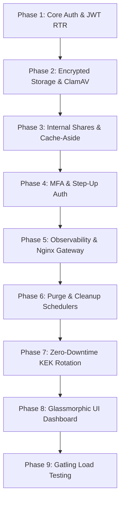

# CloudShare - Secure File Sharing Web Application

[](https://github.com/Dhruv0306/cloudshare-app/actions/workflows/maven.yml)

CloudShare is a production-ready, highly secure, enterprise-grade file-sharing web application built using **Spring Boot 3.5**, a **modern dark glassmorphic JavaScript SPA**, and a robust infrastructure stack. It is engineered with strict cryptographic boundaries, zero-trust security pipelines, multi-dimensional caching/security layers, and complete runtime observability.

---

## 🛠️ Enterprise-Grade Technology Stack

### 🚀 Application & Core Backend
*   **Java 17+ & Spring Boot 3.5**: Utilizing modern Spring Security, Spring Data JPA, and Spring Boot Actuator.
*   **Structured JSON Logging**: Custom Logback configuration powered by `logstash-logback-encoder` to format output for ELK ingestion.
*   **Metrics & Telemetry**: Exposed via Micrometer and Prometheus endpoints.

### 💾 Multi-Tier Storage & Database Architecture
*   **PostgreSQL 17**: Core relational storage managed via **Flyway Schema Migrations**.
    *   *Audit Log Range Partitioning*: The audit log table is range-partitioned monthly (e.g., `audit_logs_y2026m10`, `audit_logs_y2026m11`) to prevent tablespace performance degradation.
*   **Dual-Redis Architecture**: Two independent Redis deployments to optimize resources and lifecycle policies:
    *   **Cache-Aside (Port 6379)**: Metadata caching, session store, configured with a `256MB maxmemory` and `allkeys-lru` eviction policy.
    *   **Security & Rate-Limiter (Port 6380)**: Token blacklisting, Multi-Factor Authentication verification keys, and sliding-window rate limiting. Configured with a `noeviction` policy to prevent premature rate-limit or security state loss.
*   **Pluggable Object Storage**: Supports local filesystem storage for development, MinIO (S3-compatible API) for self-hosted container deployments, or AWS S3 for production.

### 🛡️ Hardened Security & Anti-Malware
*   **Envelope Encryption**: All stored files are encrypted using an individual AES-256 **File Encryption Key (FEK)**. The FEK is wrapped with a version-aware 256-bit **Key Encrypting Key (KEK)** derived from a Master KEK.
*   **Anti-Virus Scanning**: Inbound files pass through a **ClamAV** container daemon sidecar before persistence.
*   **MIME Validation**: Strict magic-byte structure check via **Apache Tika** preventing filename/extension spoofing.
*   **Security Controls**: CSRF protection, CORS policies, XSS mitigation, secure cookies, and distributed sliding-window rate limiting.

### 🎭 Modern Glassmorphic Frontend
*   **Vanilla JS SPA**: A sleek Single Page Application built with HTML5 and Vanilla CSS using modern dark glassmorphic design principles.
*   **Integrated API Layer**: Native Fetch client wrapping bearer tokens, handling Refresh Token Rotation (RTR) and step-up authentication.

---

## 📚 The 9 Implementation Phases

The development and hardening of CloudShare were executed across 9 structured phases:



1.  **Core Authentication & User Management (Phase 1)**: Integrated Spring Security with JSON Web Tokens (JWT) featuring Refresh Token Rotation (RTR) to mitigate token hijacking.
2.  **File Upload & Cryptographic Operations (Phase 2)**: Standardized file upload and download pipelines with AES-256 envelope encryption. Added ClamAV daemon antivirus integration and Apache Tika MIME detection.
3.  **Sharing & Collaboration (Phase 3)**: Designed internal user-to-user resource shares (READ/WRITE permissions) and password-protected public download links with download limits, access counts, and auto-expiry.
4.  **Security Hardening & Step-up Access (Phase 4)**: Added distributed sliding-window rate limiting via Redis Lua scripts, Multi-Factor Authentication (MFA/TOTP), and Step-Up authentication for sensitive administrative actions.
5.  **Observability & Reverse Proxy Nginx Gateway (Phase 5)**: Wired correlation/trace IDs into MDC filters for request-response tracking. Added Prometheus metric outputs, JSON formatting in Logback, and Nginx reverse proxy with SSL termination.
6.  **Lifecycle Schedulers (Phase 6)**: Configured background cron jobs (`FilePurgeScheduler` and `LinkCleanupScheduler`) to purge soft-deleted files older than 30 days and clean expired links.
7.  **KEK Rotation Worker (Phase 7)**: Created a database-locked command line worker profile (`rekey-job`) utilizing Postgres `FOR UPDATE SKIP LOCKED` to migrate file encryption keys to a new KEK version with zero service downtime.
8.  **Frontend SPA Application (Phase 8)**: Built a frontend dashboard providing reactive panels for files, sharing, MFA settings, and administrative user lists.
9.  **Gatling Performance Load Testing (Phase 9)**: Created scale simulations in Gatling verifying HTTP response times, streaming throughput, and rate limiter capacities under pressure.

---

## 🚀 Local Development Guide

### 📋 Prerequisites
*   **Java 17+ JDK**
*   **Maven 3.8+**
*   **Docker & Docker Compose**
*   **Python 3.x** (for integration test suite)

### 1. Environment Setup
Create a `.env` file in the root directory and copy the contents from `.env.example`:
```bash
cp .env.example .env
```
Fill in the credentials, including generating a secure 256-bit key for your `CRYPTO_MASTER_KEK` and a 512-bit key for your `JWT_SECRET`.

### 2. Generate Local SSL Certificates
Nginx requires local SSL certificates to terminate TLS 1.3 connections. Run the certificate generation script:
*   **Linux/macOS:**
    ```bash
    chmod +x nginx/ssl/generate-certs.sh
    ./nginx/ssl/generate-certs.sh
    ```
*   **Windows (PowerShell):**
    ```powershell
    Set-ExecutionPolicy -Scope Process -ExecutionPolicy Bypass
    .\nginx\ssl\generate-certs.ps1
    ```

### 3. Launch Docker Compose Infrastructure
Spin up the supporting infrastructure (PostgreSQL, Dual-Redis, ClamAV, MinIO, Nginx):
```bash
docker compose up -d
```
*   This initiates Nginx on port `80` (redirecting to TLS `443`), Postgres on port `5432`, Cache Redis on port `6379`, Security Redis on port `6380`, MinIO API on port `9000` (Console UI on `9001`), and ClamAV on port `3310`.

### 4. Start the Backend Application
Run the Spring Boot application locally:
```bash
mvn spring-boot:run
```
Alternatively, build the executable JAR and run it:
```bash
mvn clean package -DskipTests
java -jar target/cloudshare-1.0.0.jar
```

Now, navigate to **`https://localhost`** in your browser to access the application.

---

## 🧪 Running the Test Suites

CloudShare features three levels of validation:

### 1. Unit & Integration Tests
Runs the JUnit 5 tests, Mockito mocks, and internal H2 database test validations:
```bash
mvn clean test
```

### 2. End-to-End API Integration Tests
An end-to-end Python test suite verifying API security boundaries, user flows, MFA setup, rate limits, and triggers. Make sure the Docker services and Spring Boot app are running, then execute:
```bash
pip install requests
python tests/api_test.py
```

### 3. Gatling Performance Load Tests
Validates the performance non-functional requirements (KPIs: p95 API latency < 200ms, error rate < 0.1%). Run against the target environment using:
```bash
mvn verify -Pperformance
```

---

## 🔑 Key Management & KEK Rotation Runbook

When migrating to a new Key Encrypting Key (KEK) version, you run the application in a dedicated command line runner mode. This halts web servers and schedulers, using `SKIP LOCKED` database locks to safely rewrite row data in batches without transaction conflicts.

To trigger a re-keying job (e.g., migrating from version 1 to version 2):
```bash
java -jar target/cloudshare-1.0.0.jar \
  --spring.profiles.active=rekey-job \
  --rekey.oldVersion=1 \
  --rekey.newVersion=2
```

---

## 📅 Audit Log Partitioning Strategy

The application uses Postgres Range Partitioning on `audit_logs.created_at`.
*   Active monthly tables are mapped in Flyway migrations.
*   **V1 Migration** creates tables for `2026-06` through `2026-09`.
*   **V3 Migration** extends partitions for `2026-10` through `2027-06`.
*   *Note:* The lifecycle schedulers are planned to be extended in future iterations to dynamically evaluate dates and run `CREATE TABLE IF NOT EXISTS` DDL statements automatically to eliminate manual schema upkeep.
