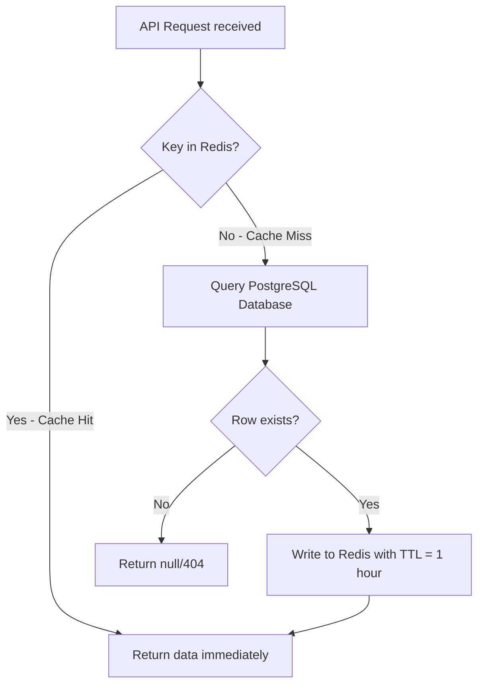

# Caching & Rate Limiting Strategy

To prevent relational database saturation and block malicious scraping or brute-force attacks, CloudShare deploys **Redis** as an in-memory cache and rate-limiting store.

---

## 1. Redis Roles & Data Structure Mapping

Redis operates as a stateless cache running side-by-side with PostgreSQL. It stores three primary datasets:

| Dataset Category | Redis Key Pattern | Data Structure | TTL (Time-to-Live) | Eviction Policy |
| :--- | :--- | :--- | :--- | :--- |
| **Revoked JWTs** | `blacklist:token:<jti>` | String | Remaining token life | No eviction (static expiry) |
| **Cache-Aside Metadata**| `cache:user:<id>` <br> `cache:permissions:<file_id>` | Hash / String | 1 Hour | `allkeys-lru` (Evict old) |
| **API Rate Limits** | `limit:<ip_or_userid>:<endpoint>` | Sorted Set / String | 1 Minute | `allkeys-lru` (Evict old) |

---

## 2. The Cache-Aside Pattern

For performance optimization on database queries (e.g., checking user metadata or resolving file access permissions during downloads), the application follows the **Cache-Aside** architecture:



### Cache Invalidation Rules:
To prevent dirty reads (returning outdated permissions or details), we implement active invalidation:
*   **Write-Through Eviction:** Whenever file access permissions are modified (`POST /api/v1/shares/internal`) or a file is renamed/deleted, the application immediately deletes the corresponding Redis key (`cache:permissions:<file_id>`) in the same database transaction.
*   **No Cache for Files:** The binary streams of files are *never* stored in Redis. Redis is strictly reserved for metadata, session IDs, and rate limit counters.

---

## 3. Distributed Rate Limiting (Token Bucket / Sliding Window)

To protect critical endpoints (such as authentication or file downloads) from Denial of Service (DoS) and brute-force attacks, CloudShare implements a **Sliding Window Counter** rate limiter in Redis.

To ensure atomic transactions under high concurrency, rate evaluation is executed via a **Redis Lua Script**:

```lua
-- KEYS[1] = Rate limit key (e.g., "limit:192.168.1.50:/auth/login")
-- ARGV[1] = Current Unix timestamp (seconds)
-- ARGV[2] = Window size (seconds, e.g., 60)
-- ARGV[3] = Max allowed requests in window (e.g., 5)

local key = KEYS[1]
local now = tonumber(ARGV[1])
local window = tonumber(ARGV[2])
local limit = tonumber(ARGV[3])

local clear_before = now - window

-- Remove requests outside the sliding window
redis.call('ZREMRANGEBYSCORE', key, '-inf', clear_before)

-- Count total requests in the window
local current_requests = redis.call('ZCARD', key)

if current_requests < limit then
    -- Add the current request timestamp as score and value
    redis.call('ZADD', key, now, now)
    -- Extend key expiration to cover window duration
    redis.call('EXPIRE', key, window)
    return 1 -- Allowed
else
    return 0 -- Rate limit exceeded
end
```

### 3.1 Rate Limit Thresholds:
*   **Authentication Routes (`POST /api/v1/auth/*`):** Max 5 attempts per minute per IP.
*   **File Upload Routes (`POST /api/v1/files/upload`):** Max 10 uploads per minute per User ID.
*   **Public Link Access (`GET /api/v1/shares/link/*`):** Max 30 requests per minute per IP.
*   **General REST APIs:** Max 100 requests per minute per User ID.

---

## 4. Redis Memory Tuning

If Redis reaches its memory capacity limit, it must not drop critical session tokens or blacklists.

In `redis.conf`:
```properties
# Allocate maximum memory (e.g., 512MB)
maxmemory 536870912

# Evict only temporary cache keys, protect persistent keys
maxmemory-policy volatile-lru
```
*   `volatile-lru`: Redis only removes keys with an expiration (`TTL`) set, ensuring that rate limit keys and metadata caches can be purged, while leaving active session states secure.
*   **Alerting:** Prometheus monitors `redis_memory_used_bytes`. If usage exceeds 80%, an automated alert triggers to scale Redis memory allocation.
