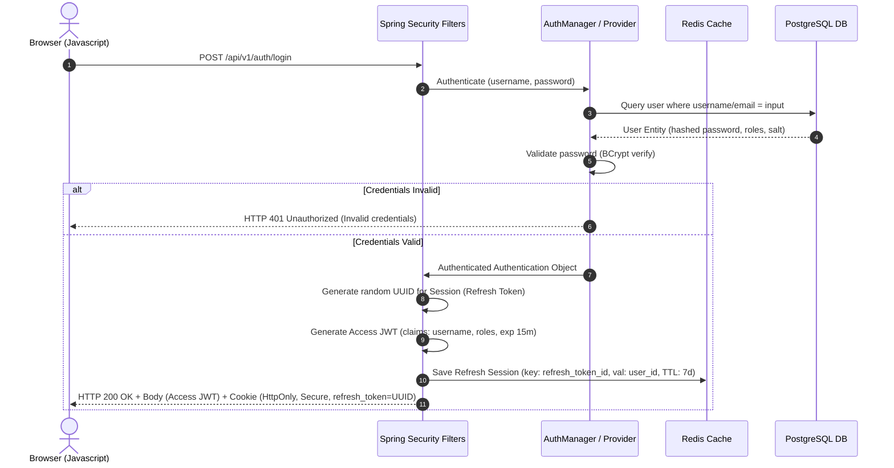
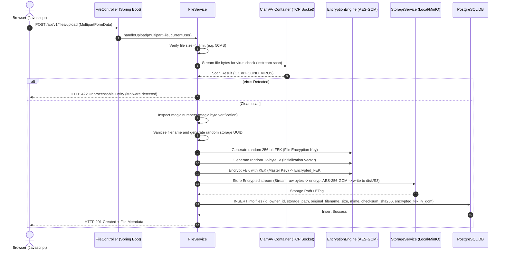
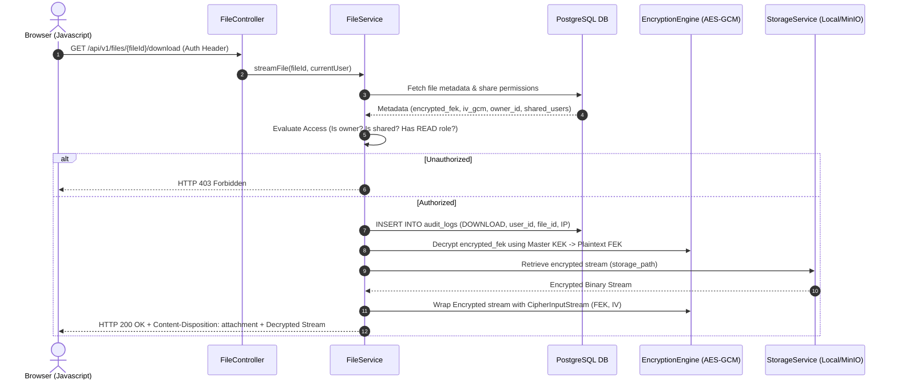
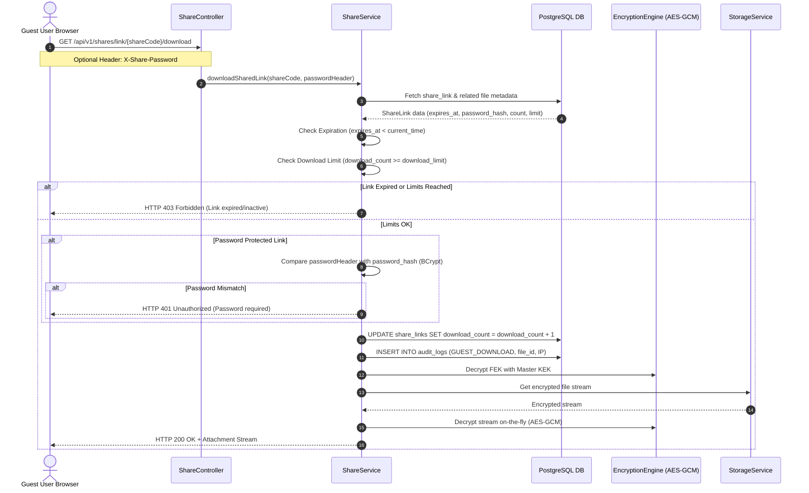

# Core Data Flows & Sequence Diagrams

This document contains step-by-step sequence diagrams showing the interaction between the Client, Spring Boot Application, Spring Security, Redis, ClamAV, the Database, and the Storage backend for key system operations.

---

## 1. User Authentication & Session Setup

This diagram shows how users log in and how their access and refresh sessions are established.

---

## 2. Secure File Upload Pipeline

During file upload, the application stream is processed sequentially: virus scanned, verified for MIME types, encrypted on the fly, stored, and cataloged.

---

## 3. Secure File Decryption & Download

File downloads must never allow direct file access. Decryption is performed in memory while streaming.

---

## 4. Secure Shared Link Verification

This flow describes accessing shared resources securely using short-lived codes with credentials.

