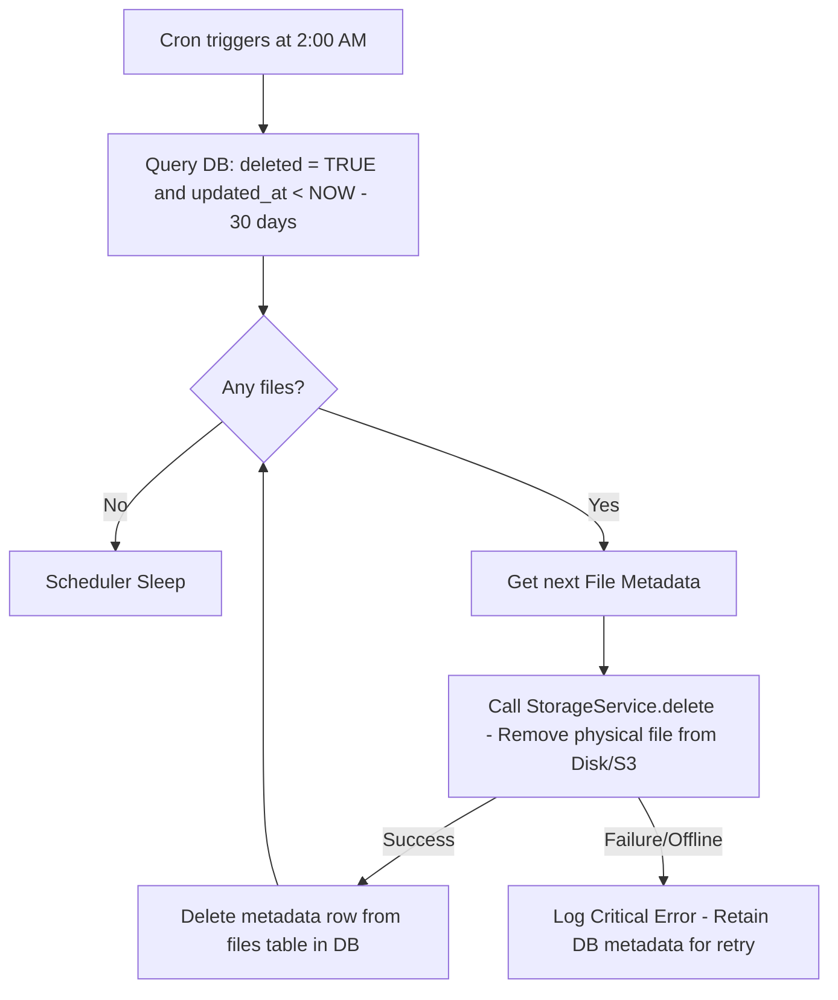

# Data Retention & Lifecycle Policies

To control infrastructure costs, optimize query execution, and adhere to global privacy frameworks (such as GDPR), CloudShare defines automated workflows for file deletion, link expiration, and user account purging.

---

## 1. Storage & Link Lifecycle States

Files and links progress through the following states during their lifetime:

```
[ Active File ] ---> (User Deletes) ---> [ Soft Deleted (Recycle Bin) ] ---> (30-Day Expiry) ---> [ Permanent Purge ]
                                                                                                    (Physical & DB Wipe)

[ Shared Link ] ---> (Expiration Time / Download Limit) ---> [ Expired / Inactive Link ] ---> (Daily Purge) ---> [ Row Deleted ]
```

### Lifecycle Rules:
1.  **Active Files:** Stored encrypted. Fully searchable by owner.
2.  **Soft Deleted (Recycle Bin):** `deleted = true` in PostgreSQL. Kept for **30 days** to allow user restoration. Files in this state do not appear in normal list queries but count toward user storage quotas.
3.  **Expired Shared Links:** Validated at runtime. Access is blocked immediately upon expiration.
4.  **Audit Logs:** Retained in PostgreSQL for 1 year, then detached, compressed, and archived to cold storage.

---

## 2. Automated Cleanup Engine (Spring Boot Schedulers)

We use Spring Boot's scheduling framework to automate cleanup tasks. These jobs are configured to run during low-traffic periods (off-peak hours).

### 2.1 File Purge Scheduler (`FilePurgeScheduler`)
*   **Schedule:** Runs daily at 2:00 AM UTC (`cron = "0 0 2 * * ?"`).
*   **Logic:** Selects all files flagged as deleted where the deletion timestamp is older than 30 days.



#### Safe Deletion Order Rule:
To prevent **orphaned storage files** (files taking up space on disk/S3 with no database pointers), the scheduler must execute deletion sequentially:
1.  Attempt physical file removal from storage.
2.  Upon verification of storage deletion, execute the database `DELETE` transaction.
3.  If the storage server is offline or fails, skip the database deletion so the job retries on the next execution cycle.

### 2.2 Shared Link Cleanup Scheduler (`LinkCleanupScheduler`)
*   **Schedule:** Runs daily at 3:00 AM UTC (`cron = "0 0 3 * * ?"`).
*   **Logic:** Deletes expired links to keep index tables compact.
    ```sql
    DELETE FROM share_links WHERE expires_at < CURRENT_TIMESTAMP;
    ```

---

## 3. GDPR Compliance: "Right to be Forgotten"

GDPR Article 17 requires that users can request the permanent removal of their personal data. CloudShare supports an **Account Deletion Flow**:

1.  **Immediate Soft-Delete:** The user's account is deactivated (`active = false`).
2.  **File Flagging:** All files owned by the user are immediately moved to `deleted = true`, with the deletion timestamp set to current time.
3.  **Cascade Cleanup:**
    *   All direct permissions mapping to other users (`file_shares`) are deleted immediately.
    *   All public sharing links (`share_links`) pointing to the user's files are deleted immediately.
4.  **Wipe Execution:** 30 days later, the automated `FilePurgeScheduler` permanently deletes all files from disk and removes the corresponding database records.
5.  **Audit Exception:** For compliance and security tracking, the audit log entries showing past transactions are *not* deleted immediately. They are kept for the standard 1-year archive window, anonymizing user names where required.
