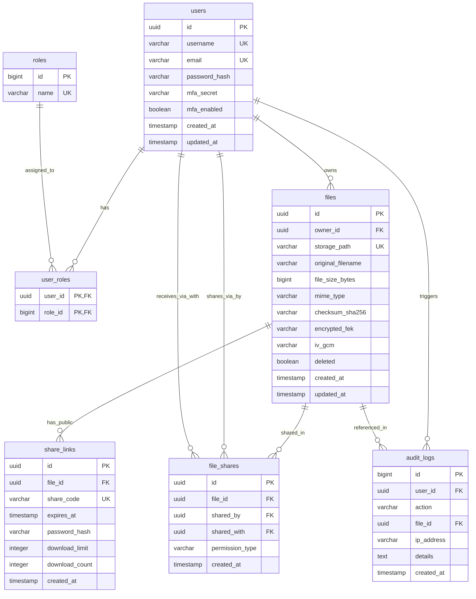

# Database Schema & ERD

This document specifies the database design for the CloudShare application. We use **PostgreSQL** as our primary relational database to manage user accounts, roles, file metadata, sharing configurations, and system audit logs.

---

## 1. Entity-Relationship Diagram (ERD)

The diagram below represents the core data model. Relationships are enforced via strict foreign key constraints at the database level.



---

## 2. PostgreSQL DDL Schema

Below are the production-ready DDL statements, including indexes, auto-increment sequences, and constraints.

```sql
-- Enable UUID extension if not already loaded
CREATE EXTENSION IF NOT EXISTS "uuid-ossp";

-- 1. Users Table
CREATE TABLE users (
    id UUID PRIMARY KEY DEFAULT uuid_generate_v4(),
    username VARCHAR(50) NOT NULL UNIQUE,
    email VARCHAR(100) NOT NULL UNIQUE,
    password_hash VARCHAR(60) NOT NULL, -- BCrypt generates 60 char hashes
    mfa_secret VARCHAR(32),
    mfa_enabled BOOLEAN DEFAULT FALSE NOT NULL,
    created_at TIMESTAMP WITH TIME ZONE DEFAULT CURRENT_TIMESTAMP NOT NULL,
    updated_at TIMESTAMP WITH TIME ZONE DEFAULT CURRENT_TIMESTAMP NOT NULL
);

-- 2. Roles Table
CREATE TABLE roles (
    id BIGSERIAL PRIMARY KEY,
    name VARCHAR(20) NOT NULL UNIQUE
);

-- 3. User Roles Mapping Table
CREATE TABLE user_roles (
    user_id UUID REFERENCES users(id) ON DELETE CASCADE,
    role_id BIGINT REFERENCES roles(id) ON DELETE CASCADE,
    PRIMARY KEY (user_id, role_id)
);

-- Seed Initial Roles
INSERT INTO roles (name) VALUES ('ROLE_USER'), ('ROLE_ADMIN') ON CONFLICT DO NOTHING;

-- 4. Files Table (Stores Metadata, Encrypted Keys, and IV)
CREATE TABLE files (
    id UUID PRIMARY KEY DEFAULT uuid_generate_v4(),
    owner_id UUID NOT NULL REFERENCES users(id) ON DELETE RESTRICT,
    storage_path VARCHAR(255) NOT NULL UNIQUE, -- UUID filename on filesystem/S3 bucket
    original_filename VARCHAR(255) NOT NULL,
    file_size_bytes BIGINT NOT NULL,
    mime_type VARCHAR(100) NOT NULL,
    checksum_sha256 VARCHAR(64) NOT NULL,
    encrypted_fek VARCHAR(128) NOT NULL, -- AES FEK encrypted by KEK (Base64)
    iv_gcm VARCHAR(24) NOT NULL, -- 12 byte IV (Base64)
    deleted BOOLEAN DEFAULT FALSE NOT NULL,
    created_at TIMESTAMP WITH TIME ZONE DEFAULT CURRENT_TIMESTAMP NOT NULL,
    updated_at TIMESTAMP WITH TIME ZONE DEFAULT CURRENT_TIMESTAMP NOT NULL
);

-- 5. Direct User-to-User Shares Table
CREATE TABLE file_shares (
    id UUID PRIMARY KEY DEFAULT uuid_generate_v4(),
    file_id UUID NOT NULL REFERENCES files(id) ON DELETE CASCADE,
    shared_by UUID NOT NULL REFERENCES users(id) ON DELETE CASCADE,
    shared_with UUID NOT NULL REFERENCES users(id) ON DELETE CASCADE,
    permission_type VARCHAR(10) NOT NULL CHECK (permission_type IN ('READ', 'WRITE')),
    created_at TIMESTAMP WITH TIME ZONE DEFAULT CURRENT_TIMESTAMP NOT NULL,
    CONSTRAINT unique_file_user_share UNIQUE (file_id, shared_with)
);

-- 6. Public Sharing Links Table
CREATE TABLE share_links (
    id UUID PRIMARY KEY DEFAULT uuid_generate_v4(),
    file_id UUID NOT NULL REFERENCES files(id) ON DELETE CASCADE,
    share_code VARCHAR(16) NOT NULL UNIQUE, -- Random alphanumeric string
    expires_at TIMESTAMP WITH TIME ZONE NOT NULL,
    password_hash VARCHAR(60), -- BCrypt hash if protected, nullable
    download_limit INTEGER, -- Self-destruct if limit reached, nullable
    download_count INTEGER DEFAULT 0 NOT NULL,
    created_at TIMESTAMP WITH TIME ZONE DEFAULT CURRENT_TIMESTAMP NOT NULL
);

-- 7. Audit Logs Table (System Activity)
CREATE TABLE audit_logs (
    id BIGSERIAL,
    user_id UUID REFERENCES users(id) ON DELETE SET NULL,
    action VARCHAR(50) NOT NULL,
    file_id UUID REFERENCES files(id) ON DELETE SET NULL,
    ip_address VARCHAR(45) NOT NULL, -- Accommodates IPv4 and IPv6
    details TEXT,
    created_at TIMESTAMP WITH TIME ZONE DEFAULT CURRENT_TIMESTAMP NOT NULL,
    PRIMARY KEY (id, created_at) -- Multi-column key required for range partitioning
) PARTITION BY RANGE (created_at);
```

---

## 3. Indexing Strategy

To keep query performance under 10ms for common search queries under high load, the following indices are created:

```sql
-- Files Index: Speeds up dashboard loading for users listing their files.
CREATE INDEX idx_files_owner ON files(owner_id) WHERE deleted = FALSE;

-- Files Soft Delete Index: Speeds up background tasks checking for files to purge.
CREATE INDEX idx_files_deleted ON files(deleted) WHERE deleted = TRUE;

-- User Roles Index: Speeds up authorization queries during Spring Security filter evaluation.
CREATE INDEX idx_user_roles_uid ON user_roles(user_id);

-- Sharing Index: Optimizes fetching files shared with the current logged-in user.
CREATE INDEX idx_file_shares_receiver ON file_shares(shared_with);

-- Public Share Codes Index: Optimizes lookups for public link access.
CREATE UNIQUE INDEX idx_share_links_code ON share_links(share_code);

-- Audit Log index for time-based analytical lookups.
CREATE INDEX idx_audit_logs_time ON audit_logs(created_at DESC);
```

---

## 4. Partitioning & Archiving Strategy

The `audit_logs` table grows rapidly in active environments. Writing millions of rows will slow down index structures and disk reads.

*   **Partition Strategy:** We use **PostgreSQL Declarative Partitioning** to partition the `audit_logs` table by range on the `created_at` column.
*   **Interval:** Partitioning is configured monthly.
*   **Partition Creation DDL Example:**
    ```sql
    -- Example partitions for Q2 2026
    CREATE TABLE audit_logs_y2026m06 PARTITION OF audit_logs
        FOR VALUES FROM ('2026-06-01 00:00:00+00') TO ('2026-07-01 00:00:00+00');
    
    CREATE TABLE audit_logs_y2026m07 PARTITION OF audit_logs
        FOR VALUES FROM ('2026-07-01 00:00:00+00') TO ('2026-08-01 00:00:00+00');
    ```
*   **Archiving:** A quarterly cron job detaches partitions older than 1 year, exports them to compressed cold storage (CSV/Parquet format), and drops the detached partitions from PostgreSQL.

---

## 5. Database Connection Pool Settings (HikariCP)

For production loads, the Spring Boot configuration (`application.yml`) uses HikariCP tuned for resource efficiency:

```yaml
spring:
  datasource:
    hikari:
      pool-name: CloudShareHikariPool
      maximum-pool-size: 25 # Core count * 2 + spindle count rule
      minimum-idle: 10
      idle-timeout: 600000 # 10 minutes
      max-lifetime: 1800000 # 30 minutes
      connection-timeout: 30000 # 30 seconds
      leak-detection-threshold: 2000 # 2 seconds to trace unclosed connections
```
