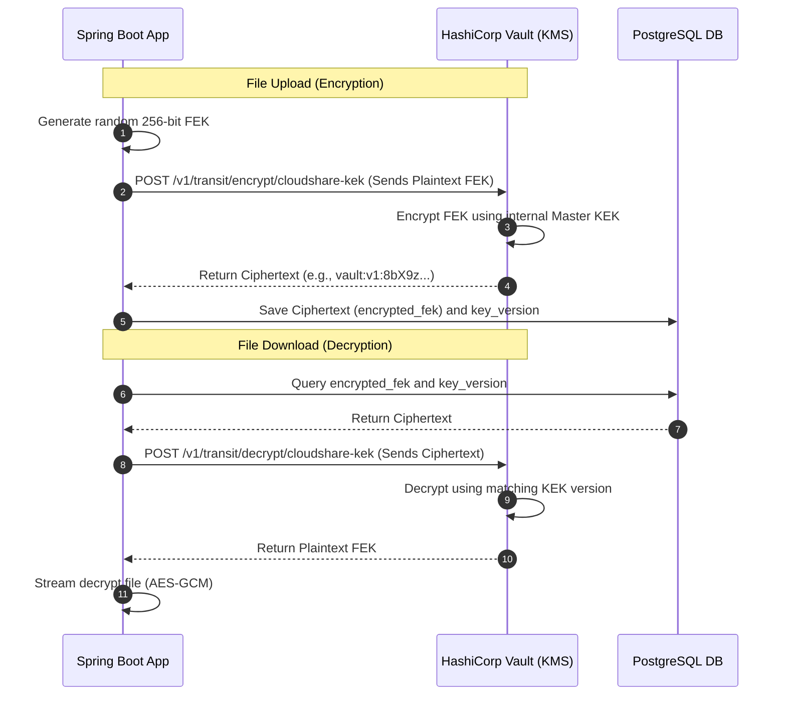
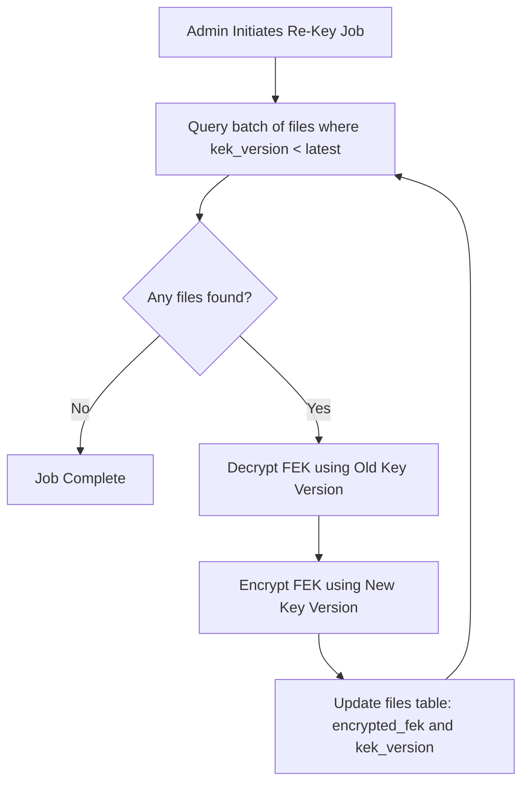

# Key Management & Secrets Rotation

In a secure file-sharing system, encrypting files is only as secure as the management of the cryptographic keys themselves. This document specifies the secrets hierarchy, integration with external Key Management Services (KMS), and key rotation operations.

---

## 1. Secrets Hierarchy

CloudShare divides configuration secrets and cryptographic keys into distinct security classifications:

```
+---------------------------------------------------------------------------------+
| Level 3: Master KEK (Key Encryption Key)                                        |
| Managed externally (AWS KMS / HashiCorp Vault). Never enters application RAM.  |
+---------------------------------------------------------------------------------+
                                      |
                                      v (Encrypts / Decrypts)
+---------------------------------------------------------------------------------+
| Level 2: FEKs (File Encryption Keys)                                            |
| Unique AES-256 key per file. Stored encrypted in PostgreSQL.                    |
+---------------------------------------------------------------------------------+
                                      |
                                      v (Encrypts / Decrypts)
+---------------------------------------------------------------------------------+
| Level 1: Application Secrets & Config                                           |
| DB Passwords, Redis Tokens, JWT Secrets. Injected via K8s Secrets / Env.        |
+---------------------------------------------------------------------------------+
```

---

## 2. Key Management Service (KMS) Integration

To keep the master **Key Encryption Key (KEK)** secure, CloudShare integrates with the **HashiCorp Vault Transit Secret Engine** (or cloud alternatives like AWS KMS).

Using the **Transit Engine**, the Spring Boot application *never* holds the plaintext KEK in its memory space. Instead, cryptography is offloaded:



### Benefit:
If the Spring Boot container is fully compromised at runtime, the attacker can only read keys currently active in memory. They cannot extract the KEK to decrypt the rest of the database, as the master KEK remains isolated inside Vault.

---

## 3. Key Rotation Strategy

Cryptographic standards recommend rotating keys periodically (e.g., annually) or immediately upon suspected leakage. CloudShare supports two key rotation models:

### 3.1 Versioned Key Decryption (Recommended)
This approach avoids massive database write tasks by storing the key version identifier alongside the encrypted FEK.

*   **Database Schema Mapping:** The `files` table contains a `kek_version` integer column.
*   **Rotation Execution Flow:**
    1.  The security administrator triggers key rotation in the KMS (e.g., Vault generates a new version `v2` of the `cloudshare-kek`).
    2.  All subsequent file uploads call the KMS, which automatically encrypts the new FEK using `v2`. The application records `kek_version = 2` in PostgreSQL.
    3.  When a user downloads an old file (`kek_version = 1`), the application passes the ciphertext to the KMS. The KMS checks the metadata, routes it to the historical `v1` KEK, decrypts it, and returns the FEK.
    4.  No background data re-encryption is needed, resulting in zero performance degradation.

### 3.2 Full Re-Encryption Runbook
If a specific key version is compromised, all data encrypted under that version must be updated. This is handled via a CLI administrative utility in the Spring Boot app:



*   **Concurrency Control:** The job uses database row locks (`SELECT FOR UPDATE SKIP LOCKED`) to ensure multi-node application deployments can run the re-encryption task concurrently without processing the same rows twice.
*   **Audit Logging:** Every re-encryption operation writes a system audit log entry:
    `RE_KEY_OPERATION: File UUID xxx upgraded from KEK v1 to KEK v2`.

---

## 4. Application Configuration Secrets (Level 1)

For credentials (DB password, Redis token, SMTP credentials):
*   **Development:** Injected via a local `.env` file read by Docker-Compose (never committed to git).
*   **Production (Kubernetes):** Externalized using `Kubernetes Secrets` mapped as environment variables in the pod manifest.
