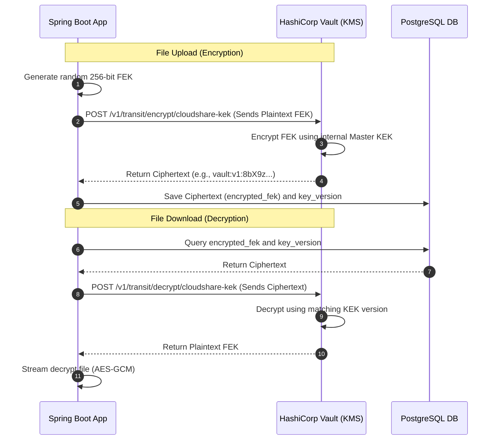
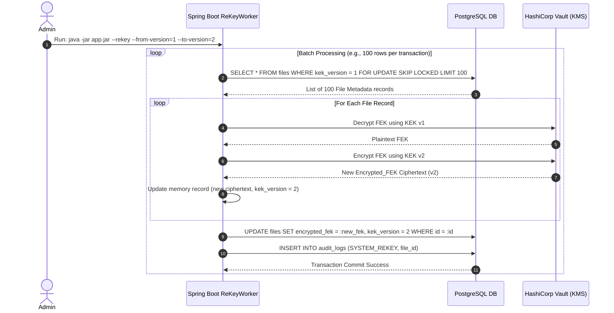

# Key Management & Secrets Rotation

In a secure file-sharing system, encrypting files is only as secure as the management of the cryptographic keys themselves. This document specifies the secrets hierarchy, integration with external Key Management Services (KMS), and key rotation operations.

---

## 1. Secrets Hierarchy

CloudShare divides configuration secrets and cryptographic keys into distinct security classifications:

```
+---------------------------------------------------------------------------------+
| Level 3: Master KEK (Key Encryption Key)                                        |
| Managed externally (AWS KMS / HashiCorp Vault). Never enters application RAM.  |
+---------------------------------------------------------------------------------+
                                      |
                                      v (Encrypts / Decrypts)
+---------------------------------------------------------------------------------+
| Level 2: FEKs (File Encryption Keys)                                            |
| Unique AES-256 key per file. Stored encrypted in PostgreSQL.                    |
+---------------------------------------------------------------------------------+
                                      |
                                      v (Encrypts / Decrypts)
+---------------------------------------------------------------------------------+
| Level 1: Application Secrets & Config                                           |
| DB Passwords, Redis Tokens, JWT Secrets. Injected via K8s Secrets / Env.        |
+---------------------------------------------------------------------------------+
```

---

## 2. Key Management Service (KMS) Integration

To keep the master **Key Encryption Key (KEK)** secure, CloudShare integrates with the **HashiCorp Vault Transit Secret Engine** (or cloud alternatives like AWS KMS).

Using the **Transit Engine**, the Spring Boot application *never* holds the plaintext KEK in its memory space. Instead, cryptography is offloaded:



### Benefit:
If the Spring Boot container is fully compromised at runtime, the attacker can only read keys currently active in memory. They cannot extract the KEK to decrypt the rest of the database, as the master KEK remains isolated inside Vault.

---

## 3. Key Rotation Strategy

Cryptographic standards recommend rotating keys periodically (e.g., annually) or immediately upon suspected leakage. CloudShare supports two key rotation models:

### 3.1 Versioned Key Decryption (Recommended)
This approach avoids massive database write tasks by storing the key version identifier alongside the encrypted FEK.

*   **Database Schema Mapping:** The `files` table contains a `kek_version` integer column.
*   **Rotation Execution Flow:**
    1.  The security administrator triggers key rotation in the KMS (e.g., Vault generates a new version `v2` of the `cloudshare-kek`).
    2.  All subsequent file uploads call the KMS, which automatically encrypts the new FEK using `v2`. The application records `kek_version = 2` in PostgreSQL.
    3.  When a user downloads an old file (`kek_version = 1`), the application passes the ciphertext to the KMS. The KMS checks the metadata, routes it to the historical `v1` KEK, decrypts it, and returns the FEK.
    4.  No background data re-encryption is needed, resulting in zero performance degradation.

### 3.2 Full Re-Encryption Runbook (Compromise Recovery)
If a specific KEK version is leaked or compromised, versioned routing is not enough—all active FEKs encrypted under the compromised KEK must be decrypted and re-encrypted using the new KEK immediately.



#### 1. Concurrency & Locking Mechanics (`SKIP LOCKED`)
To prevent multiple application pods from processing the same files or creating lock contention, the database select query uses row-level locks:
```sql
SELECT * FROM files 
WHERE kek_version = :oldVersion 
  AND deleted = FALSE
FOR UPDATE SKIP LOCKED 
LIMIT 100;
```
*   `FOR UPDATE`: Locks the selected rows so no other process can modify them.
*   `SKIP LOCKED`: If another Spring Boot instance has already locked a batch of 100 rows, this query skips them entirely and fetches the next available 100 rows. This allows linear horizontal scaling of the re-keying process.

#### 2. Re-Keying Worker Implementation (Java Sketch)
```java
@Component
@Profile("rekey-job")
public class ReKeyWorker implements CommandLineRunner {

    @Autowired
    private FileRepository fileRepository;
    @Autowired
    private VaultTransitService vaultService;

    @Transactional
    public int processNextBatch(int oldVersion, int newVersion) {
        // Query utilizing FOR UPDATE SKIP LOCKED
        List<FileMetadata> batch = fileRepository.findBatchForReKey(oldVersion, PageRequest.of(0, 100));
        if (batch.isEmpty()) {
            return 0;
        }

        for (FileMetadata file : batch) {
            // 1. Decrypt FEK using historical KEK version
            byte[] plaintextFek = vaultService.decrypt(file.getEncryptedFek(), oldVersion);
            
            // 2. Encrypt FEK using target KEK version
            String newCiphertext = vaultService.encrypt(plaintextFek, newVersion);
            
            // 3. Save new metadata
            file.setEncryptedFek(newCiphertext);
            file.setKekVersion(newVersion);
            fileRepository.save(file);
            
            log.info("Successfully re-keyed file metadata. UUID: {}, New KEK Version: {}", file.getId(), newVersion);
        }
        return batch.size();
    }

    @Override
    public void run(String... args) {
        int oldVer = Integer.parseInt(System.getProperty("rekey.oldVersion"));
        int newVer = Integer.parseInt(System.getProperty("rekey.newVersion"));
        
        int processed;
        do {
            processed = processNextBatch(oldVer, newVer);
        } while (processed > 0);
        
        log.info("Re-keying job completed successfully.");
    }
}
```
*   **Zero Downtime:** Users can upload and download files continuously during this runbook. Downloads of files not yet re-keyed transparently fetch `kek_version = 1`, while completed rows pull `kek_version = 2`.
*   **Writethrough Safety:** Physical file binary objects are never touched—only the 32-byte database keys are updated, meaning terabytes of storage remain intact without network IO overhead.

---

## 4. Application Configuration Secrets (Level 1)

For credentials (DB password, Redis token, SMTP credentials):
*   **Development:** Injected via a local `.env` file read by Docker-Compose (never committed to git).
*   **Production (Kubernetes):** Externalized using `Kubernetes Secrets` mapped as environment variables in the pod manifest.
